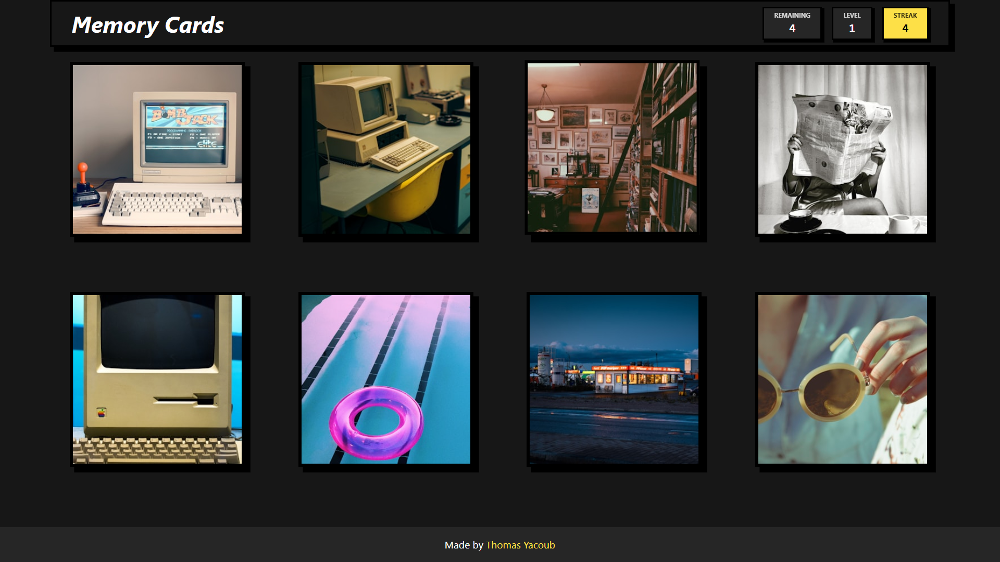

# Memory Cards ([play](https://memory-cards-ecru.vercel.app/))

A simple memory card game built with React. Click cards without repeating one twice, clear all 3 levels to win.


## Tech Stack

- **React** – UI
- **Vite** – dev server & build
- **Panda CSS** – styling (`css`, `cva`, patterns from `styled-system`)
- **Unsplash API** – random card images

## Project Structure

```
src/
├── components/
│   ├── Header.jsx        # top bar (level, remaining, streak)
│   ├── Cards.jsx         # cards grid + Card + CardImg
│   ├── Footer.jsx        # footer
│   ├── GameOverlay.jsx   # win / lose screen
│   └── ui/
│       └── ScoreBoard.jsx
├── hooks/
│   └── useCards.js       # fetches card images from Unsplash
├── utils/
│   └── shuffle.js        # Fisher-Yates shuffle
├── App.jsx               # game logic & state
├── main.jsx               # entry point
└── index.css
```

## Getting Started

1. Install dependencies:
   ```bash
   npm install
   ```
2. Create a `.env` file in the project root with your Unsplash API key:
   ```
   VITE_UNSPLASH_API_KEY=your_key_here
   ```
3. Run the dev server:
   ```bash
   npm run dev
   ```